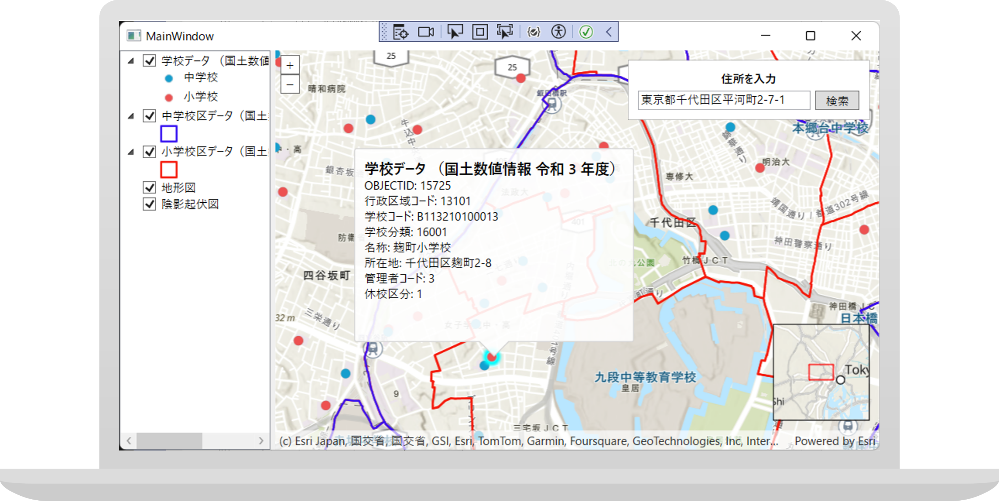

# startup-sample-dotnet

* [ArcGIS Runtime SDK for .NET](https://developers.arcgis.com/net/)
* [ArcGIS Pro](https://pro.arcgis.com/ja/pro-app/)

## 動作環境
### OS
* Windows 10 / 8.1 / 7

### 開発環境
* Visual Studio 2017
* Visual Studio 2015 Update 3
* Visual Studio Express 2015 for Windows Desktop Update 3
* Visual Studio 2013 Update 5
* Visual Studio Express 2013 for Windows Desktop Update 5
* Visual Studio 2012 Update 4
* Visual Studio Express 2012 for Windows Desktop Update 4

## リソース

## ライセンス
Copyright 2018 Esri Japan Corporation.

Apache License Version 2.0（「本ライセンス」）に基づいてライセンスされます。あなたがこのファイルを使用するためには、本ライセンスに従わなければなりません。本ライセンスのコピーは下記の場所から入手できます。

> http://www.apache.org/licenses/LICENSE-2.0

適用される法律または書面での同意によって命じられない限り、本ライセンスに基づいて頒布されるソフトウェアは、明示黙示を問わず、いかなる保証も条件もなしに「現状のまま」頒布されます。本ライセンスでの権利と制限を規定した文言については、本ライセンスを参照してください。

ライセンスのコピーは本リポジトリの[ライセンス ファイル](./LICENSE)で利用可能です。

